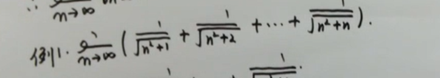
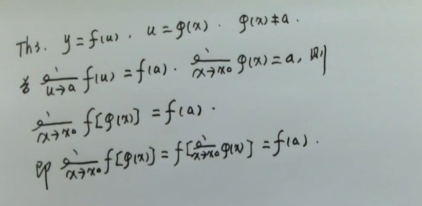

# 第一章 函数与极限

## 1.1 函数
### 函数举例
-----
|||
|---|---|
||-1,x<0|
|y=sgn(x)=|0,x=0|
||1,x>0|   
-----
|||
|---|---|
||0,$x\in Q$|
|y=D(x)=||
||0,$x\notin Q$|
-----
左取整函数
$$y=[x]$$
### 反函数
若$y=f(x)(x\in D)$严格单调

EX: $y=ln(x+\sqrt{x^2+1})$    
### 基本函数
1. $x^a$
2. $a^x$
3. loga^x(...)
4. sinx,cosx,tanx,cotx,secx,cscx
5. arcsinx,arccosx,arctanx,arccotx

### 初等函数
由常数和基本函数经四则运算和复合运算而成的式子

### 初等性质
#### 奇偶性
#### 单调性
#### 有界性
$\exist M>0,对\forall x,有 |f(x)|\leq M|$,则f(x)在D上有界    
上界,下界...
#### 周期性

## 1.2 数列极限
$(\epsilon - N)设 {a_n}为数列,A为常数,如果对\forall\epsilon>0,\exist N>0,当n>N时,|a_n-A|<\epsilon,则称a_n\to A(n\to\infty)$    
EX: 证明$(n\to\infty)\frac{n-1}{2n}=\frac{1}{2}$    
### 性质
1. 极限唯一性 _试证明_
2. 有界性 若$(n \to\infty)a_n=A,则\exist M>0 使得|a_n| \leq M$ _试证明_ 
3. 保号性 证明 (取$\epsilon=\frac{A}{2}$)
   
## 1.3 函数极限
_$(\epsilon-\delta)$_    
_$(\epsilon-X)$_
### 性质
$函数极限存在\leftrightarrow函数左右极限存在且相等$
1. 极限唯一性 _反证_(取极限A,B)
2. 有界性(局部)  证明(||a|-|b||<= |a-b|)
3. 保号性 证明 (取$\epsilon=\frac{A}{2}$)

## 1.4 无穷小和无穷大
### 无穷小
极限为0,$x\to0,f(x)为无穷小A$
_0为无穷小,无穷小不一定为0_
#### 性质
1. 无穷小相加减依然是无穷小
2. 无穷小与常数相乘依然是无穷小
3. $\lim_{x \to 0}{f(x)=A}\leftrightarrow f(x)=A+\alpha,\alpha\to0,x \to x_0$
4. 无穷小之积还是无穷小
5. $\alpha\to 0,\beta\le M,则\alpha\beta\to 0$
EX:$\lim_{x\to 0}{x^2sin\frac{1}{x}}=0$    

### 无穷大
EX:证明:    
$\lim_{x\to 1}{\frac{2}{(x-1)^2}}=\infty$    
$\lim_{x\to \infty}{(2x^2+1)}=\infty$
### 无穷大与无穷小关系
#### 性质
1. $\lim_{x\to x_0}{f(x)}=0 \leftrightarrow \lim_{x\to x_0}{\frac{1}{f(x)}}=\infty$    

## 1.5 极限运算法则
### 四则极限法则
设$\lim_{x\to x_0}{f(x)}=A,\lim_{x\to x_0}{g(x)}=B,$
1. $\lim_{[x\to x_0}{f(x)\pm g(x)]}=\lim_{x\to x_0}{f(x)}\pm\lim_{x\to x_0}{g(x)}$
2. $\lim_{x\to x_0}{kf(x)}=k\lim_{x\to x_0}{f(x)}=kA$
3. $\lim_{x\to x_0}{f(x)g(x)}=\lim_{x\to x_0}{f(x)}\lim_{x\to x_0}{g(x)}$ 
4. $\lim_{x\to x_0}{\frac{f(x)}{g(x)}}=\frac{\lim_{x\to x_0}{f(x)}}{\lim_{x\to x_0}{g(x)}},\lim_{x\to x_0}{g(x)}\not ={0}$

常见:
1. $p(x)=a_nx^n+...+a_1x+a_0,则\lim_{x\to x_0}{p(x)}=p(x_0)$
2. $p(x)=a_nx^n+...+a_1x+a_0,q(x)=a_nx^n+...+a_1x+a_0,则\lim_{x\to x_0}{\frac{p(x)}{q(x)}}=\frac{p(x_0)}{q(x_0)}$
3. $p(x)=a_nx^n+...+a_1x+a_0,q(x)=a_nx^n+...+a_1x+a_0,则\lim_{x\to x_0}{\frac{p(x)}{q(x)}}=\frac{p(x_0)}{q(x_0)}$
4. 

### 复合函数极限法则
    

## 1.6 极限存在准则
###  收敛定理(夹逼定理)
数列例题    
    
函数例题(_数学归纳_:1,k,k+1)    
    
### 两个重要极限
1. $\lim_{x\to 0}{\frac{sinx}{x}}=1$    
       
   
2. $\lim_{x\to \infty}{(1+\frac{1}{n})^n}$    
       
重要极限例题    
    

## 1.7 无穷小的比较
$\alpha\to 0,\beta\le M,则\alpha\beta\to 0$    
EX:$\lim_{x\to 0}{x^2sin\frac{1}{x}}=0$    
高阶无穷小    
    
同阶无穷小,等价无穷小,k阶无穷小    
      
### 等价无穷小性质
1. $\alpha\to 0,\beta\to 0,则\alpha ~\beta\leftrightarrow\beta=\alpha+o(\alpha)$
2. $\alpha\to 0,\beta\to 0,\alpha~\alpha 1,\beta~\beta 1,\lim{\frac{\beta 1}{\alpha 1}}=A,则\lim{\frac{\beta}{\alpha}}=A$
### 常见的等价无穷小:$(x\to 0)$
1. x~sinx 
2. x~tanx
3. x~arcsinx
4. x~arctanx
5. x~ln(1+x)
6. x~$e^x-1$
7. 1-cosx ~ $\frac{1}{2}x^2$
8. $(1+x)^a-1$~ ax

## 1.8 函数的连续性和间断点
### 连续性
### 间断点
#### 分类    
1. 第一类间断点:f(a-0),f(a+0)存在
>1. 可去间断点: f(a-0)=f(a+0)$\not ={f(a)}$    
>2. 跳跃间断点: f(a-0)$\not ={f(a+0)}$
2. 第二类间断点:f(a-0),f(a+0)至少一个不存在,_则x=a为第二间断点_
例题:    
    

## 1.9 连续函数的运算及初等函数的连续性
### 连续函数的运算
#### 四则
f(x)g(x)在$x=x_0$处连续,则 在x=x_0处,
1. f(x)$\pm$g(x)
2. f(x)g(x)
3. f(x)/g(x),($g(x_0)\not ={0}$)    
连续
#### 复合
    
_lim往里钻_    
### 初等函数连续性
1. 基本函数在定义域内连续
2. 初等函数在定义域内连续
## 1.10 闭区间上的连续函数性质
### 最值定理 
### 有界定理
### 零点定理
设$f(x)\in [a,b],若f(a)f(b)<0,则\exist c \in (a,b),使f(c)=0$
### __介值定理__
### 应用情形

