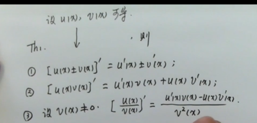
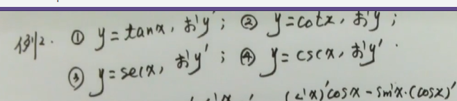
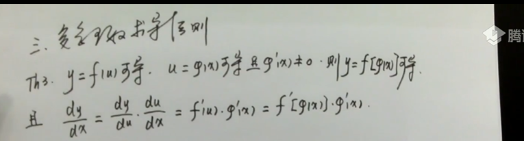
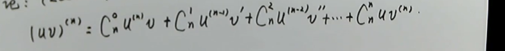

# 第二章 导数与微分
## 2.1导数

_可导必连续,连续不一定可导_

### 常用导数公式
|函数|导数|
|---|---|
|c|0|
|$x^n$|$nx^{n-1}$|
|$a^x$|$a^xlna$|
|$\log_{a}{x}$|$\frac{1}{xlna}$|
|sinx|cosx|
|cosx|-sinx|
|tanx|$sec^2x$|
|cotx|$-csc^2x$|
|secx|secx*tanx|
|cscx|-cscx*cotx|
|arcsinx||
|arccosx||
|arctanx||
|arccotx||

## 2.2 求导法则
### 四则

### 反函数
反函数导数互为导数(乘积为1)
$f^{'}(x)\not ={0}\leftrightarrows 函数严格单调$
### 复合函数

### 求导方法概况
||三大工具|
|---|---|
|(1)|基本公式|
|(2)|四则|
|(3)|复合|

## 2.3 高阶导数
### 方法
#### 1.归纳法
#### 2.公式法
莱布尼茨公式:

## 2.4 隐函数及由参数方程确定的函数求导
### 隐函数求导
_y=f(x)显函数,F(x,y)=0隐函数_    
_由F(x,y)=0$\to$y=f(x),隐函数的显示化_    
__求导方法__:将y看作x的函数    
### 由参数方程确定的函数求导

## 微分
_可导$\leftrightarrows$可微_    
$df(x)=f^{'}(x)d(x)$    
$\triangle y-dy=o(x)$    
